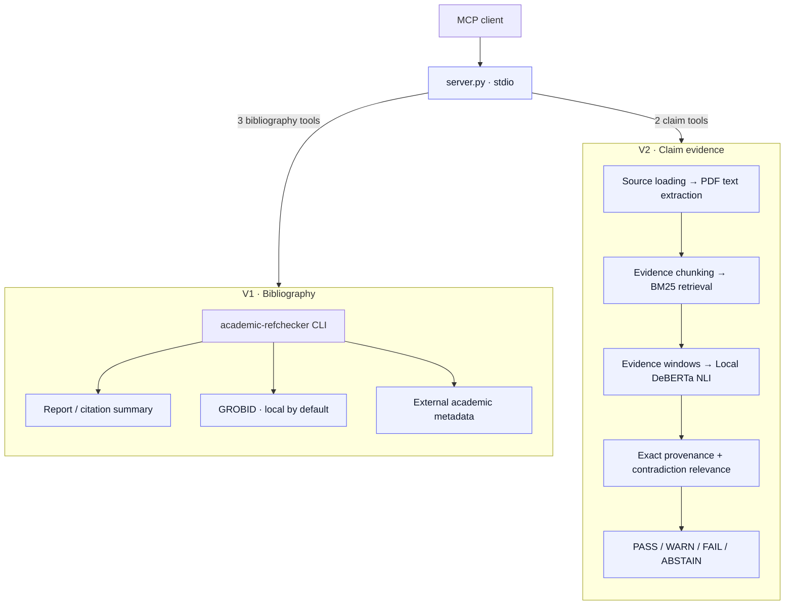

# Citation Verifier MCP

[](LICENSE)
[](pyproject.toml)
[](#tools)
[](#requirements)

**A local-first Model Context Protocol server for citation verification and bibliography checking.**

Check references and inspect whether a paper supports a factual claim, directly from Kilo or another MCP client. Bibliography tools use academic-refchecker; claim verification uses local DeBERTa inference, BM25 retrieval and exact evidence provenance.

**Local inference, explicit network boundaries.** Source downloads and RefChecker metadata lookups can contact external services. GROBID runs locally by default. See [Network and privacy](#network-and-privacy) before processing sensitive material.

[Install](#installation-windows) · [Tools](#tools) · [Examples](#usage-examples) · [Verdicts](#verdicts) · [Limitations](#known-limitations)

> **Citation hallucination** is a growing problem in AI-assisted research. LLMs invent plausible-looking references that do not exist. This project provides a unified, local-first pipeline:
>
> 1. **Load** a supported source (local PDF, arXiv paper, or direct PDF URL)
> 2. **Extract** canonical PDF text
> 3. **Retrieve** relevant evidence chunks via BM25
> 4. **Verify** exact provenance (character-level offsets in the source)
> 5. **Score** claim–evidence pairs with a local DeBERTa NLI model
> 6. **Gate** strong contradiction candidates using topical overlap
> 7. **Decide** with a deterministic verdict policy

---

## Features

| Feature | Description |
|---------|-------------|
| **Local inference** | DeBERTa-v3 NLI model runs on CPU (PyTorch); no GPU required |
| **Exact provenance** | Evidence quotes include character offsets and page numbers; `PASS` requires verified provenance |
| **Relevance-gated contradictions** | Strong contradiction verdicts require topical evidence overlap; reduces some unrelated-evidence artifacts (heuristic coverage ≥0.30) |
| **Five MCP tools** | `verify_document`, `verify_bibliography`, `citation_summary`, `verify_claim`, `verify_claims` |
| **Batch reuse** | Multiple claims on the same source reuse loaded text, chunks, and BM25 index |
| **Failure isolation** | One failed claim in a batch does not abort others |
| **Deterministic verdicts** | `PASS` / `WARN` / `FAIL` / `ABSTAIN` with explicit reasons |
| **Numeric guard** | Claims with numbers must match evidence numbers exactly |
| **Safe failures** | Source, network and extraction failures → `ABSTAIN`, never `FAIL` |

---

## Architecture



> **V1 vs V2:** `citation_summary`, `verify_document`, and `verify_bibliography` use the V1 RefChecker (external CLI). `verify_claim` and `verify_claims` use the V2 pipeline (local DeBERTa NLI + BM25 + provenance). See [Architecture Guide](docs/architecture.md).

Exact spans are checked before NLI scoring; the decision policy requires verified provenance. Coverage filters strong contradictions, including those used for conflict decisions, and does not independently validate entailments. V2 persists source text, chunks and verification records locally in SQLite.

---

## Tools

| Tool | Input | Output | Purpose |
|------|-------|--------|---------|
| `verify_document` | `source: string` — arXiv ID, URL, PDF path, BibTeX, LaTeX, or plain-text file | RefChecker report with reference status | Verify all citations in a paper |
| `verify_bibliography` | `path: string` — local file (PDF, BibTeX, LaTeX, plaintext) | RefChecker report | Check bibliography file |
| `citation_summary` | `source: string` — arXiv ID, URL, PDF, or BibTeX | Normalized stats + health grade | Quick citation health check |
| `verify_claim` | `claim: string`, `source: string`, `top_k?: int` (default 5) | Verdict + evidence + scores | Verify one claim against a source |
| `verify_claims` | `claims: array[{claim, source}]`, `top_k?: int` (default 5) | Batch results + reuse stats | Verify multiple claims efficiently |

V1 accepts source identifiers or files through RefChecker; “text” means a file, not arbitrary inline source text. V2 supports local PDFs, arXiv IDs/URLs and public direct PDF URLs; DOI full-text resolution is not implemented.

`top_k` is optional on the two V2 tools only: 1–20, default 5 unless `CITATION_BM25_TOP_K` overrides it. MCP discovery exposes `claims` as an array of generic objects; each item's `claim` and `source` strings are validated at runtime. Batches accept up to 100 items.

---

## Requirements

| Requirement | Version | Notes |
|-------------|---------|-------|
| Windows | Windows 11 tested | Windows-first scripts; Windows 10 not independently verified |
| Linux / macOS | Untested | May work; PowerShell scripts are Windows-first |
| Docker Desktop | Latest | Required for GROBID |
| Python | 3.13+ | `py` launcher preferred; only 3.13.7 independently verified |
| Internet | Setup and remote verification | Package/model/image downloads, remote PDFs and RefChecker metadata lookups |

No API keys or tokens required. All inference runs locally.

---

## Installation (Windows)

The GitHub URL below is a placeholder until publication. Replace `<your-username>` with the published owner. Bootstrap requires Python >=3.13; the independently verified environment is Python 3.13.7 on Windows 11.

Bootstrap retains the selected interpreter and validates the Python version of newly created and reused `.venv` environments before installing packages. Without `-Force`, unsupported, broken or incomplete existing environments are preserved and rejected. Before explicit `-Force` recreation, confirm exclusive ownership, stop clients and back up the environment; see [safe recovery](docs/troubleshooting.md#module-import-errors).

```powershell
# 1. Clone the repository
git clone https://github.com/<your-username>/citation-verifier-mcp.git
cd citation-verifier-mcp

# 2. Bootstrap environment (creates .venv, installs deps, downloads model)
.\scripts\bootstrap.ps1

# 3. Start GROBID (citation parsing service)
.\scripts\start.ps1

# 4. Verify everything is ready
.\scripts\doctor.ps1

# 5. Generate Kilo config snippet
.\scripts\print_kilo_config.ps1
```

Copy the JSON block from step 5 into your Kilo configuration (see [Kilo Setup Guide](docs/kilo-setup.md)).

### Dependencies

The bootstrap script installs:

| Package | Version | Purpose |
|---------|---------|---------|
| `mcp` | 2.2.0 | MCP protocol, pinned in `requirements.txt` |
| `pdfplumber` | 0.11.10 | PDF text extraction (pdfminer.six backend) |
| `rank-bm25` | 0.2.2 | BM25 lexical retrieval |
| `requests` | 2.34.2 | HTTP client |
| `torch` | 2.14.0+cpu | PyTorch CPU build |
| `transformers` | 5.17.0 | DeBERTa-v3 NLI model |
| `sentencepiece` | 0.2.2 | Tokenizer |

> **PyTorch CPU index:** The CPU-only PyTorch build is installed from `https://download.pytorch.org/whl/cpu`. This index URL is **not** stored in `pyproject.toml` — users running manual installation must supply it.
>
> **Dependency commands used by bootstrap.ps1** (after creating `.venv`; the full bootstrap also prepares the model and checks imports):
> ```powershell
> .\.venv\Scripts\python.exe -m pip install torch==2.14.0+cpu --index-url https://download.pytorch.org/whl/cpu
> .\.venv\Scripts\python.exe -m pip install -r requirements.txt
> .\.venv\Scripts\python.exe -m pip install academic-refchecker==3.0.190
> ```
>
> **V1 RefChecker:** `academic-refchecker==3.0.190` is a pip-installable package. Bootstrap installs it separately when its executable is missing. The server invokes `.venv\Scripts\academic-refchecker.exe` as a subprocess.

**Model:** `cross-encoder/nli-deberta-v3-small` (~170 MB, cached locally after first download)

**If model download stalls:**

```powershell
$env:HF_HUB_DISABLE_XET=1
.\scripts\bootstrap.ps1
```

### GROBID and External Services

The `start.ps1` script manages a local GROBID container via Docker Compose:

```powershell
# Default port 8070
.\scripts\start.ps1

# Custom port
$env:GROBID_HOST_PORT=9070
$env:GROBID_URL="http://127.0.0.1:9070"
.\scripts\start.ps1
```

**Security:** The repository's Compose configuration binds GROBID to `127.0.0.1`. Existing containers or a custom `GROBID_URL` may have different exposure. Set both port variables for a custom port and ensure Kilo inherits `GROBID_URL` after restarting it. See [Kilo Setup](docs/kilo-setup.md).

**Note:** V2 verification (`verify_claim`, `verify_claims`) does **not** require GROBID. GROBID is only used by V1 tools (`citation_summary`, `verify_document`, `verify_bibliography`).

### Kilo MCP Configuration

Generate the config snippet:

```powershell
.\scripts\print_kilo_config.ps1
```

Named entry printed by the helper (illustrative paths; insert directly under `mcp`):

```jsonc
"citation-verifier": {
  "type": "local",
  "command": [
    "C:\\path\\to\\your\\repo\\.venv\\Scripts\\python.exe",
    "C:\\path\\to\\your\\repo\\server.py"
  ],
  "enabled": true,
  "timeout": 600000
}
```

Merge into `~/.config/kilo/kilo.jsonc` (global) or `<repo>/.kilo/kilo.jsonc` (project-specific, overrides global). The helper separately prints the optional `"citation-verifier_*": "allow"` permission entry; merge it into the existing `permission` object if desired. It never edits your configuration.

Reload the client after config changes; in VS Code, use **Developer: Reload Window**. Environment changes require fully exiting the host and launching it from the configured shell; a window reload may retain old values.

Verify in Kilo: MCP panel shows `citation-verifier` as **Connected** with 5 tools.

---

## Usage Examples

These calls use arXiv `2607.22693`, the historical regression source. Response excerpts illustrate the public structure and recorded outcomes; they are not newly executed verification results. Model scores and external metadata can vary.

### Single Claim Verification

```json
{
  "claim": "The paper studies hallucinated and suspicious citations.",
  "source": "2607.22693"
}
```

**Illustrative response excerpt.** The quote is shortened for readability; offsets, page numbers and scores are omitted. This displayed excerpt cannot be used to validate exact provenance. A real response supplies the complete quote and exact offsets into canonical extracted text.

```json
{
  "ok": true,
  "verdict": "PASS",
  "semantic_class": "SUPPORTED",
  "reason": "STRONG_ENTAILMENT_WITH_PROVENANCE",
  "evidence": {
    "quote": "…hallucinated and suspicious references have become a real and growing threat…",
    "provenance_verified": true
  }
}
```

### Batch Verification (same-source reuse)

```json
{
  "claims": [
    { "claim": "The paper studies hallucinated and suspicious citations.", "source": "2607.22693" },
    { "claim": "The paper does not discuss hallucinated citations.", "source": "2607.22693" }
  ]
}
```

```json
{
  "total": 2,
  "source_loads": 1,
  "bm25_indexes_built": 1,
  "unique_sources": 1,
  "results": [
    { "index": 0, "verdict": "PASS", "semantic_class": "SUPPORTED", "reason": "STRONG_ENTAILMENT_WITH_PROVENANCE" },
    { "index": 1, "verdict": "FAIL", "semantic_class": "CONTRADICTED", "reason": "STRONG_CONTRADICTION" }
  ]
}
```

### Citation Summary (V1 RefChecker)

```json
{ "source": "2607.22693" }
```

```json
{
  "ok": true,
  "total_references_processed": 24,
  "total_errors": 0,
  "total_warnings": 11,
  "total_unverified_references": 0,
  "total_information": 1,
  "citation_health": "Fair"
}
```

---

## Verdicts

| Verdict | Semantic Class | When |
|---------|----------------|------|
| `PASS` | `SUPPORTED` | Strong entailment (≥0.70) **with verified provenance** and numeric match |
| `WARN` | `CONFLICTING_EVIDENCE` | Strong entailment and relevant strong contradiction with verified provenance; dominance safeguard does not apply |
| `WARN` | `PARTIALLY_SUPPORTED` | Moderate entailment (0.50 ≤ score < 0.70) with verified provenance |
| `WARN` | `PARTIALLY_SUPPORTED` | Strong entailment without numeric match |
| `FAIL` | `CONTRADICTED` | Strong contradiction (≥0.70) **with verified provenance** and **topical relevance** |
| `ABSTAIN` | `INSUFFICIENT_EVIDENCE` | No eligible evidence, contradiction dominance, or unavailable/unsupported source; inspect `reason` and `source_state` |

> **Key rules:**
>
> - `PASS` is **forbidden** unless `provenance_verified == true`.
> - Numeric claims must match evidence numbers exactly.
> - `FAIL` requires **both** strong contradiction **and** topical relevance — evidence below coverage 0.30 is excluded. This heuristic does not guarantee correct verdicts; synonym-based contradictions can be missed.
> - Source/network/extraction failures → `ABSTAIN`, never `FAIL`.
> - `ABSTAIN` means "could not verify," **not** "claim is false."

These are default thresholds. Strong-score cutoffs can be configured. See [Verdicts Guide](docs/verdicts.md) for the full decision policy.

---

## Known Limitations

| Limitation | Status |
|------------|--------|
| DOI full-text resolution | Not implemented → returns `ABSTAIN` |
| Lexical coverage is a heuristic | Claims with no content-word overlap may `ABSTAIN` even if semantically related |
| Synonym-based contradictions | May conservatively produce `ABSTAIN` (no lexical overlap after stemming) |
| Custom stemmer | Simplified suffix-stripper, not a general-purpose semantic model |
| ASCII-only tokenization | Non-ASCII terms may lose characters in the relevance gate |
| Broad benchmark accuracy | Not established; relevance threshold 0.30 is a heuristic |
| Scanned PDFs / OCR | No OCR fallback; extractable PDF text required |
| Title/author → reference resolution | Not implemented |
| Native Windows GUI / `.exe` installer | Not provided |
| Linux/macOS support | Untested |
| RefChecker runtime | ~5–6 min for 24 refs; external runners need ≥12 min timeout |
| Windows pytest temp | Permission denied on default temp; use `--basetemp=<writable>` |

See [Limitations](docs/limitations.md) for details.

---

## Documentation

| Document | Purpose |
|----------|---------|
| [Architecture](docs/architecture.md) | Pipeline diagram and module responsibilities |
| [Verdicts](docs/verdicts.md) | Detailed verdict semantics and decision policy |
| [Limitations](docs/limitations.md) | Honest accounting of what the system cannot do |
| [Development](docs/development.md) | Local development, testing, and contribution guide |
| [Troubleshooting](docs/troubleshooting.md) | Common issues and fixes |
| [Kilo Setup](docs/kilo-setup.md) | Step-by-step Kilo integration guide |
| [Third-Party Licenses](THIRD_PARTY.md) | Dependency and model license inventory |

---

## Contributing

Contributions are welcome. See [CONTRIBUTING.md](CONTRIBUTING.md) for guidelines.

Key requirements:

- All changes must include tests
- No secrets or private data in commits
- Provenance bypass is strictly forbidden
- Verdict policy changes require documented justification

---

## Network and privacy

No API key is required for this server's local claim inference. Local inference does not establish end-to-end offline operation.

| Component | Where it runs / what may leave the machine |
|-----------|------------------------------------------|
| DeBERTa NLI | CPU inference uses locally cached weights (`local_files_only=True`); claims and evidence are processed locally by this component |
| Source retrieval | arXiv IDs and PDF URLs cause outbound HTTP requests when retrieval is needed; destination servers receive the requested identifier/URL and normal connection metadata |
| RefChecker (V1) | A local subprocess can query external academic services, including arXiv, Crossref and DBLP; reference titles, authors, identifiers and other lookup fields may be transmitted |
| GROBID | Local by default; RefChecker sends PDFs to the configured parsing endpoint. A remote `GROBID_URL` sends document content off the machine |
| Setup and README assets | pip, model preparation and Docker image pulls use external services. README badges load from Shields.io through the viewer |

V2 stores PDFs, canonical text and verification records in local cache/SQLite. A local PDF with an already cached model can avoid source/model downloads, but the complete application is not guaranteed offline. Review external-service behavior before submitting confidential documents.

See [SECURITY.md](SECURITY.md) for vulnerability reporting. The policy describes network boundaries and the planned GitHub private reporting channel and its publication gate.

- GROBID binds to `127.0.0.1` by default (loopback only)
- The V2 source loader blocks non-public destinations and enforces download size limits, redirect limits and timeouts
- These V2 controls do not establish equivalent restrictions for RefChecker's external subprocess

---

## License

This project is released under the **MIT License** (see [LICENSE](LICENSE)).

Third-party components have their own licenses:

- `academic-refchecker` — see its repository
- `cross-encoder/nli-deberta-v3-small` — model license (see Hugging Face)
- GROBID — Apache 2.0
- PyTorch, Transformers, etc. — their respective licenses

See [THIRD_PARTY.md](THIRD_PARTY.md) for the complete inventory.

---

*Trace the citation. Inspect the evidence. Keep the research judgment yours.*
