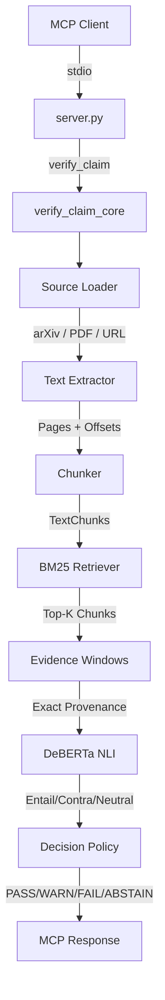

# Citation Verifier MCP

**A local-first Model Context Protocol server for citation verification and bibliography checking.**

The Citation Verifier MCP connects to Kilo (or any MCP-compatible client) and provides five tools to verify whether a source supports a claim, check bibliography quality, and audit references in academic papers. All inference runs locally on your machine — no API keys, no cloud calls, no data leaves your machine.

---

## Problem

Citation hallucination is a growing problem in AI-assisted research. LLMs invent plausible-looking references that do not exist. Existing verification tools are fragmented, require cloud APIs, or only check bibliography formatting without semantic validation.

This project provides a unified, local-first pipeline:

1. **Load** a source (arXiv paper, PDF, bibliography file, or URL)
2. **Extract** full text and references
3. **Retrieve** relevant evidence chunks via BM25
4. **Score** claim–evidence pairs with a local DeBERTa NLI model
4. **Verify** exact provenance (character-level offsets in the source)
5. **Decide** with a deterministic verdict policy

---

## Features

| Feature | Description |
|---------|-------------|
| **Local inference** | DeBERTa-v3 NLI model runs on CPU (PyTorch); no GPU required |
| **Exact provenance** | Evidence quotes include character offsets and page numbers; `PASS` requires verified provenance |
| **Five MCP tools** | `verify_document`, `verify_bibliography`, `citation_summary`, `verify_claim`, `verify_claims` |
| **Batch reuse** | Multiple claims on the same source reuse loaded text, chunks, and BM25 index |
| **Failure isolation** | One failed claim in a batch does not abort others |
| **Deterministic verdicts** | `PASS` / `WARN` / `FAIL` / `ABSTAIN` with explicit reasons |
| **Numeric guard** | Claims with numbers must match evidence numbers to `PASS` |
| **Safe failures** | Source/Network/Extraction failures → `ABSTAIN`, never `FAIL` |

---

## Architecture Overview



---

## Verified Tools

| Tool | Input | Output | Purpose |
|------|-------|--------|---------|
| `verify_document` | `source: string` (arXiv ID, URL, PDF path, BibTeX, LaTeX, text) | Full RefChecker report | Verify all citations in a paper |
| `verify_bibliography` | `path: string` (local file) | Full RefChecker report | Check bibliography file |
| `citation_summary` | `source: string` (arXiv ID, URL, PDF) | Normalized stats + health | Quick citation health check |
| `verify_claim` | `claim: string`, `source: string`, `top_k?: int` | Verdict + evidence + scores | Verify one claim against a source |
| `verify_claims` | `claims: array[{claim, source}]`, `top_k?: int` | Batch results + reuse stats | Verify multiple claims efficiently |

---

## Installation

### Prerequisites

| Requirement | Version | Notes |
|-------------|---------|-------|
| Windows 10/11 | — | Linux/macOS untested |
| Docker Desktop | Latest | For GROBID |
| Python | 3.13+ | `py` launcher preferred |
| Internet | First run only | Model download (~170 MB) |

No API keys or tokens required. All inference runs locally.

---

### Quick Start (Windows)

```powershell
# 1. Clone the repository
git clone https://github.com/<your-username>/citation-verifier-mcp.git
cd citation-verifier-mcp

# 2. Bootstrap environment (creates .venv, installs deps, downloads model)
.\scripts\bootstrap.ps1

# 3. Start GROBID (citation parsing service)
.\scripts\start.ps1

# 4. Verify everything is ready
.\scripts\doctor.ps1

# 5. Generate Kilo config snippet
.\scripts\print_kilo_config.ps1
```

Copy the JSON block from step 5 into your Kilo configuration (see [Kilo Setup Guide](docs/kilo-setup.md)).

---

### Docker / GROBID Setup

The `start.ps1` script manages a local GROBID container via Docker Compose:

```powershell
# Default port 8070
.\scripts\start.ps1

# Custom port
$env:GROBID_HOST_PORT=9070
$env:GROBID_URL=http://127.0.0.1:9070
.\scripts\start.ps1
```

**Important:** Set both `GROBID_HOST_PORT` (Docker mapping) and `GROBID_URL` (application URL). Restart Kilo after changing environment variables.

**Security:** GROBID is bound to `127.0.0.1` by default (`docker-compose.yml`). It is only accessible from localhost. See [SECURITY.md](SECURITY.md) for details.

---

### Portable Python Environment

The `bootstrap.ps1` script creates an isolated `.venv`:

```powershell
# Uses py -3.13 -m venv .venv (falls back to python -m venv)
.\scripts\bootstrap.ps1

# Force recreate
.\scripts\bootstrap.ps1 -Force
```

Installs:
- `mcp==2.2.0` (MCP protocol)
- `pdfplumber==0.11.10` (PDF extraction)
- `rank-bm25==0.2.2` (lexical retrieval)
- `requests==2.34.2` (HTTP)
- `torch==2.14.0+cpu` (PyTorch CPU)
- `transformers==5.17.0` (DeBERTa NLI)
- `sentencepiece==0.2.2` (tokenizer)
- `academic-refchecker` (external CLI, installed separately)

Model: `cross-encoder/nli-deberta-v3-small` (~170 MB, cached locally)

**If model download stalls:**
```powershell
$env:HF_HUB_DISABLE_XET=1
.\scripts\bootstrap.ps1
```

---

### Kilo MCP Configuration

Generate the config snippet:

```powershell
.\scripts\print_kilo_config.ps1
```

Example output (paths will match your clone):

```jsonc
{
  "mcp": {
    "servers": {
      "citation-verifier": {
        "type": "local",
        "command": [
          "C:\\path\\to\\your\\repo\\.venv\\Scripts\\python.exe",
          "C:\\path\\to\\your\\repo\\server.py"
        ],
        "enabled": true,
        "timeout": 600000
      }
    }
  },
  "permission": {
    "citation-verifier_*": "allow"
  }
}
```

Paste into `~/.config/kilo/kilo.jsonc` (global) or `<repo>/.kilo/kilo.jsonc` (project-specific, recommended). **Merge** the `permission` object; do not replace it.

Reload Kilo: `Ctrl+Shift+P` → "Developer: Reload Window".

Verify in Kilo: MCP panel shows `citation-verifier` as **Connected** with 5 tools.

---

## Usage Examples

### Single Claim Verification

```json
{
  "claim": "The paper studies hallucinated and suspicious citations.",
  "source": "2607.22693"
}
```

**Expected response** (truncated):
```json
{
  "ok": true,
  "verdict": "PASS",
  "semantic_class": "SUPPORTED",
  "reason": "STRONG_ENTAILMENT_WITH_PROVENANCE",
  "evidence": {
    "quote": "...hallucinated and suspicious references are a growing challenge...",
    "start_char": 5205,
    "end_char": 6585,
    "page_start": 2,
    "page_end": 2,
    "provenance_verified": true
  },
  "scores": { "entailment": 0.98, "contradiction": 0.0006, "neutral": 0.018 },
  "provenance_verified": true
}
```

### Batch Verification (same source reuse)

```json
{
  "claims": [
    { "claim": "The paper studies hallucinated and suspicious citations.", "source": "2607.22693" },
    { "claim": "The paper does not discuss hallucinated citations.", "source": "2607.22693" }
  ]
}
```

**Response includes reuse stats:**
```json
{
  "total": 2,
  "source_loads": 1,
  "bm25_indexes_built": 1,
  "unique_sources": 1,
  "results": [
    { "index": 0, "verdict": "PASS", "source_state": "FULL_TEXT" },
    { "index": 1, "verdict": "FAIL", "source_state": "FULL_TEXT" }
  ]
}
```

### Citation Summary (V1 RefChecker)

```json
{
  "source": "2607.22693"
}
```

```json
{
  "ok": true,
  "total_references_processed": 24,
  "total_errors": 0,
  "total_warnings": 11,
  "total_unverified_references": 0,
  "total_information": 1,
  "citation_health": "Fair"
}
```

---

## Verdicts Explained

| Verdict | Semantic Class | When |
|---------|----------------|------|
| `PASS` | `SUPPORTED` | Strong entailment **with verified provenance** |
| `WARN` | `CONFLICTING_EVIDENCE` / `MODERATE_ENTAILMENT` | Conflicting or moderate evidence |
| `FAIL` | `CONTRADICTED` | Strong contradiction with provenance |
| `ABSTAIN` | `INSUFFICIENT_EVIDENCE` / `UNSUPPORTED_SOURCE` / etc. | Insufficient evidence, source failure, or unsupported source type |

**Key rule:** `PASS` is **forbidden** unless `provenance_verified == true`. Numeric claims must match evidence numbers exactly.

See [Verdicts Guide](docs/verdicts.md) for details.

---

## Testing

```powershell
# Unit tests (fast, no network/Docker)
.\.venv\Scripts\python.exe -m pytest -m "unit and not slow" -q --basetemp=<writable>

# Full suite
.\.venv\Scripts\python.exe -m pytest -q --basetemp=<writable>

# MCP discovery smoke test
.\scripts\smoke_test.ps1
```

**Windows temp workaround:** Default pytest temp (`C:\Users\...\AppData\Local\Temp\pytest-of-user`) is permission-denied. Use `--basetemp=<writable>` (e.g., a folder in the repo).

**RefChecker timing note:** The `citation_summary` tool invokes `academic-refchecker.exe` which takes ~5–6 minutes for 24 references. The application has a 600s timeout; external runners must allow ≥12 minutes.

---

## Known Limitations

| Limitation | Status |
|------------|--------|
| DOI full-text resolution | Not implemented → returns `ABSTAIN` |
| Title/author → reference resolution | Not implemented |
| Native Windows GUI / `.exe` installer | Not provided |
| Linux/macOS support | Untested |
| RefChecker runtime | ~5–6 min for 24 refs; external runners need ≥12 min timeout |
| Windows pytest temp | Permission denied on default temp; use `--basetemp` |

See [Limitations](docs/limitations.md) for details.

---

## Documentation

| Document | Purpose |
|----------|---------|
| [Architecture](docs/architecture.md) | Pipeline diagram and module responsibilities |
| [Verdicts](docs/verdicts.md) | Detailed verdict semantics and decision policy |
| [Limitations](docs/limitations.md) | Honest accounting of what the system cannot do |
| [Development](docs/development.md) | Local development, testing, and contribution guide |
| [Troubleshooting](docs/troubleshooting.md) | Common issues and fixes |
| [Kilo Setup](docs/kilo-setup.md) | Step-by-step Kilo integration guide |

---

## License

This project is released under the **MIT License** (see `LICENSE`).

Third-party components:
- `academic-refchecker` — separate license (see its repository)
- `cross-encoder/nli-deberta-v3-small` — model license (see Hugging Face)
- GROBID — Apache 2.0
- PyTorch, Transformers, etc. — their respective licenses

See `THIRD_PARTY.md` for the complete third-party license inventory.

---

*No telemetry, no cloud calls, no tracking. Your papers stay on your machine.*