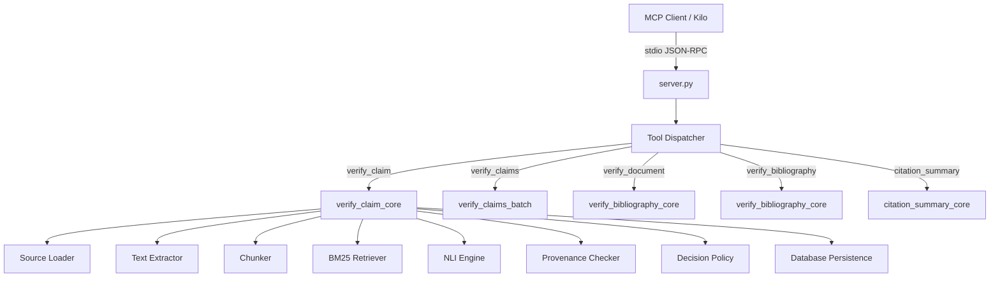

# Architecture

## Overview

The Citation Verifier MCP is a local-first Model Context Protocol (MCP) server that verifies whether a source supports a factual claim. It runs entirely on the user's machine — no API keys, no cloud calls, no data leaves the device.



## Pipeline Stages

### 1. Source Loading (`source_loader.py`)

Accepts the following source identifiers:

| Input Type | Detection | Loader |
|---|---|---|
| arXiv ID | `^\d{4}\.\d{4,5}(?:v\d+)?$` or `^[A-Za-z0-9.\-]+/\d{7}(?:v\d+)?$` | arXiv API download |
| URL | `https://...` | HTTP download with redirect handling |
| Local PDF path | Windows drive letter or `.pdf` extension | pdfplumber extraction |
| BibTeX | `.bib` file or inline string | BibTeX parsing |
| LaTeX | `.tex` file or inline string | LaTeX reference extraction |
| Plain text | Any other string | Treated as raw text source |

**Security measures:**
- SSRF protection: outbound connections are blocked to RFC1918 ranges, localhost, and link-local addresses
- Download size limit: `MAX_SOURCE_DOWNLOAD_BYTES` (default 100 MB)
- Redirect limit: `HTTP_MAX_REDIRECTS` (default 5)
- Timeout: connection 15s, read 120s

**Caching:** Raw downloaded files are cached in `cache/raw/` with TTL (`RAW_PDF_TTL_DAYS`, default 7). Normalized text is cached in `cache/text/`.

**Source document model:**
```python
SourceDocument {
    source_input: str          # original input
    canonical_id: str          # normalized identifier
    paper_id: str              # database paper identifier
    content_hash: str          # SHA-256 of canonical full text
    text: str                  # canonical full text
    pages: list[ExtractedPage]  # per-page character spans
}
```

### 2. Text Extraction (`text_extractor.py`)

- Uses pdfplumber (pdfminer.six backend) for PDF text extraction
- Produces `ExtractedPage` objects with `page_number`, `start_char`, `end_char`
- Empty pages (zero-width spans) are skipped in provenance mapping
- Text is normalized (whitespace collapsed, Unicode normalization applied)
- Normalized text is cached in `cache/text/` keyed by content hash

**Error types:**
- `PDFEncryptedError` — password-protected PDFs
- `PDFExtractionError` — general extraction failure
- `PDFNoTextError` — PDF contains no extractable text

### 3. Chunking (`chunker.py`)

- Splits canonical text into overlapping chunks
- Default: 4000 characters per chunk (`CHUNK_TARGET_CHARS`), 600 characters overlap (`CHUNK_OVERLAP_CHARS`)
- `TextChunk` dataclass: `text`, `start_char`, `end_char`, `page_start`, `page_end`, `section`
- Chunks are validated against the canonical source to ensure exact character spans
- Chunks are persisted to SQLite for reuse across verifications

### 4. Retrieval (`retrieval.py`)

- BM25 lexical search using `rank-bm25` library
- Operates on persisted chunk rows
- Returns `RetrievalResult` objects ranked by BM25 score
- Top-K configurable via `CITATION_BM25_TOP_K` (default 5, max 20)

### 5. Evidence Windows (`verifier.py`)

- Each BM25 chunk is split into smaller evidence windows (1600 char target, 300 char overlap)
- Each window's canonical source offsets are computed
- Each window is verified for exact provenance before NLI scoring

### 6. NLI Scoring (`nli.py`)

- **Model:** `cross-encoder/nli-deberta-v3-small` (~170 MB, CPU-only PyTorch)
- **Singleton:** Lazy-loaded single instance per process (`get_nli_engine()`)
- **Batching:** All evidence windows for a claim are scored in one NLI call
- **Outputs:** entailment, contradiction, neutral scores (each 0.0–1.0)
- Non-finite scores raise `VerificationIntegrityError`

### 7. Provenance Verification (`provenance.py`)

- **Exact matching:** case-sensitive, no whitespace normalization, no fuzzy matching
- `find_exact_occurrences()` — finds all exact quote positions in source text
- `verify_exact_span()` — verifies a quote matches an exact character span
- `verify_exact_quote()` — locates and verifies a quote, with optional uniqueness requirement
- `page_range_for_span()` — maps character spans to physical page numbers
- Ambiguous quotes (multiple occurrences) are flagged as `AMBIGUOUS_MULTIPLE_OCCURRENCES`

### 8. Decision Policy (`verifier.py` `_decide()`)

The decision engine applies a deterministic, ordered set of rules (see [Verdicts](verdicts.md) for full details).

### 9. Database Persistence (`database.py`)

- SQLite database at `CITATION_MCP_DB_PATH` (default `data/citations.db`)
- **Schema version:** 1 (checked at init; mismatch raises `RuntimeError`)
- **Idempotency:** Papers and chunks keyed by content hash; re-verification reuses cached chunks
- **Verification log:** Each verification is persisted with scores, verdict, and evidence metadata

### 10. Batch Processing (`batch.py`)

- Accepts up to `MAX_BATCH_ITEMS` (100) claim/source pairs
- Groups items by source string; each unique source is loaded and chunked **once**
- Each group builds one `BM25Retriever` index
- Failures are isolated: a failed claim does not abort the batch
- Order is preserved: results are returned in input order

## Module Map

```
citation-verifier-mcp/
├── server.py                      # MCP server: tool registration + JSON-RPC dispatch
├── citation_v2/                   # Verification pipeline
│   ├── __init__.py
│   ├── config.py                  # Environment-driven configuration
│   ├── source_loader.py           # Source resolution (arXiv, URL, PDF, text)
│   ├── text_extractor.py          # PDF text extraction via pdfplumber
│   ├── chunker.py                 # Text splitting and validation
│   ├── cache.py                   # File caching (raw + normalized text)
│   ├── database.py                # SQLite persistence layer
│   ├── retrieval.py               # BM25 lexical retrieval
│   ├── nli.py                     # Local DeBERTa NLI inference
│   ├── provenance.py              # Exact provenance verification
│   ├── verifier.py                # Core pipeline + decision policy
│   ├── batch.py                   # Batch processing with source reuse
│   ├── schemas.py                 # Public MCP response schemas
│   └── normalizer.py              # Text normalization
├── legacy/
│   └── server_v1_working.py       # V1 server using academic-refchecker CLI
├── tests/                         # pytest test suite (unit + integration)
└── scripts/                       # PowerShell setup/bootstrap scripts
```

## Environment Variables

| Variable | Default | Description |
|---|---|---|
| `CITATION_MCP_HOME` | Project root | Base directory for data, cache, logs |
| `CITATION_MCP_DB_PATH` | `<BASE_DIR>/data/citations.db` | SQLite database path |
| `GROBID_URL` | `http://127.0.0.1:8070` | GROBID service endpoint |
| `CITATION_BM25_TOP_K` | `5` | BM25 retrieval depth (1–20) |
| `CITATION_CHUNK_TARGET_CHARS` | `4000` | Chunk size in characters (min 500) |
| `CITATION_CHUNK_OVERLAP_CHARS` | `600` | Chunk overlap in characters |
| `CITATION_NLI_MODEL` | `cross-encoder/nli-deberta-v3-small` | NLI model identifier |
| `CITATION_NLI_ENTAILMENT_THRESHOLD` | `0.70` | Strong entailment cutoff (0.0–1.0) |
| `CITATION_NLI_CONTRADICTION_THRESHOLD` | `0.70` | Strong contradiction cutoff (0.0–1.0) |
| `CITATION_HTTP_CONNECT_TIMEOUT` | `15` | HTTP connect timeout in seconds |
| `CITATION_HTTP_READ_TIMEOUT` | `120` | HTTP read timeout in seconds |
| `CITATION_MAX_SOURCE_DOWNLOAD_BYTES` | `104857600` (100 MB) | Maximum download size |
| `CITATION_RAW_PDF_TTL_DAYS` | `7` | Raw cache TTL in days |
| `CITATION_FAILED_TEMP_TTL_HOURS` | `24` | Failed temp cache TTL in hours |
| `CITATION_SQLITE_BUSY_TIMEOUT_MS` | `5000` | SQLite busy timeout |
