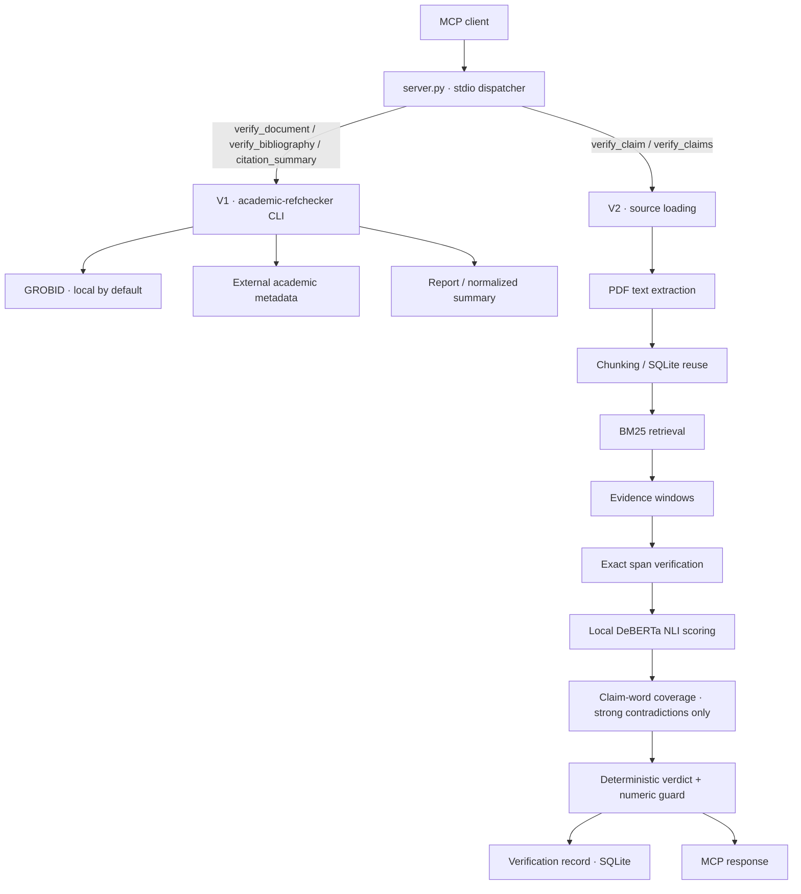

# Architecture

## Overview

Citation Verifier MCP exposes three bibliography tools through academic-refchecker (V1) and two claim-evidence tools through a local DeBERTa pipeline (V2). Inference runs locally; remote source retrieval and RefChecker metadata queries can contact external services. GROBID runs locally by default. See [Network and privacy](../README.md#network-and-privacy).



## Pipeline Stages

### 1. Source Loading (`source_loader.py`)

The V2 loader accepts the following source identifiers. V1 file formats are handled separately by RefChecker.

| Input Type | Detection | Loader |
|---|---|---|
| arXiv ID | Modern or legacy arXiv identifier, optional version | arXiv PDF download |
| URL | `https://...` | HTTP download with redirect handling |
| Local PDF path | Windows drive letter or `.pdf` extension | pdfplumber extraction |

DOI-only sources, inline plain text, BibTeX and LaTeX are not V2 full-text inputs; unsupported source types return `ABSTAIN`.

**Security measures:**

- SSRF protection: outbound connections are blocked to RFC1918 ranges, localhost, and link-local addresses
- Download size limit: `MAX_SOURCE_DOWNLOAD_BYTES` (default 100 MB)
- Redirect limit: `HTTP_MAX_REDIRECTS` (default 5)
- Timeout: connection 15s, read 120s

**Caching:** Raw downloaded files are cached in `cache/raw/` with TTL (`RAW_PDF_TTL_DAYS`, default 7). Normalized text is cached in `cache/text/`.

**Source document model (field summary):**

```text
SourceDocument {
    source_input: str          # original input
    canonical_id: str          # normalized identifier
    paper_id: int              # database paper identifier
    content_hash: str          # SHA-256 of canonical full text
    text: str                  # canonical full text
    pages: list[ExtractedPage]  # per-page character spans
}
```

### 2. Text Extraction (`text_extractor.py`)

- Uses pdfplumber (pdfminer.six backend) for PDF text extraction
- Produces `ExtractedPage` objects with `page_number`, `start_char`, `end_char`
- Empty pages (zero-width spans) are skipped in provenance mapping
- Text is conservatively normalized while retaining canonical offsets for provenance
- Normalized text is cached in `cache/text/` keyed by content hash

**Error types:**

- `PDFEncryptedError` — password-protected PDFs
- `PDFExtractionError` — general extraction failure
- `PDFNoTextError` — PDF contains no extractable text

### 3. Chunking (`chunker.py`)

- Splits canonical text into overlapping chunks
- Default: 4000 characters per chunk (`CHUNK_TARGET_CHARS`), 600 characters overlap (`CHUNK_OVERLAP_CHARS`)
- `TextChunk` dataclass: `text`, `start_char`, `end_char`, `page_start`, `page_end`, `section`
- Chunks are validated against the canonical source to ensure exact character spans
- Chunks are persisted to SQLite for reuse across verifications

### 4. Retrieval (`retrieval.py`)

- BM25 lexical search using `rank-bm25` library
- Operates on persisted chunk rows
- Returns `RetrievalResult` objects ranked by BM25 score
- Top-K configurable via `CITATION_BM25_TOP_K` (default 5, max 20)

### 5. Evidence Windows (`verifier.py`)

- Each BM25 chunk is split into smaller evidence windows (1600 char target, 300 char overlap)
- Each window's canonical source offsets are computed
- Each window is verified for exact provenance before NLI scoring
- Each window is tested for **topical relevance** to the claim (content-word coverage ≥ 0.30)

### 6. NLI Scoring (`nli.py`)

- **Model:** `cross-encoder/nli-deberta-v3-small` (~170 MB, CPU-only PyTorch)
- **Singleton:** Lazy-loaded single instance per process (`get_nli_engine()`)
- **Batching:** All evidence windows for a claim are scored in one NLI call
- **Outputs:** entailment, contradiction, neutral scores (each 0.0–1.0)
- Non-finite scores raise `VerificationIntegrityError`

### 7. Relevance Gate (`verifier.py`)

A **strong contradiction** candidate is only counted if its evidence passage shares meaningful topical content with the claim:

1. **Content words** are extracted from both the claim and the evidence — alphabetic tokens excluding 111 English stopwords (ASCII-only; hyphens split compounds into tokens)
2. **Stemming** normalizes morphological variants via a custom three-stage suffix-stripping stemmer (e.g., *hallucinated* ≡ *hallucinations* → *hallucinat*)
3. **Coverage metric**: `|claim_stems ∩ evidence_stems| / |claim_stems|` — fraction of the claim's content vocabulary found in evidence
4. **Threshold**: `MIN_CONTRADICTION_EVIDENCE_OVERLAP = 0.30`

**Scope:** The relevance gate filters **only** strong contradiction candidates. Conflict and contradiction-dominance decisions use that filtered set, so the gate can change their outcomes. It does not independently validate entailments, moderate support, numbers or provenance.

**Rationale:** NLI models assign high contradiction scores to evidence that is simply *unrelated* to the claim (semantic distance mistaken for logical contradiction). The heuristic coverage threshold of 0.30 reduces some unrelated-evidence artifacts; it does not guarantee correct verdicts. Genuine contradictions expressed with synonyms can be missed.

**Limitations:** See [Limitations](limitations.md#semantic-verification) for known gaps including synonym-based contradiction filtering, ASCII-only tokenization, and heuristic threshold status.

### 8. Provenance Verification (`provenance.py`)

- **Exact matching:** case-sensitive, no whitespace normalization, no fuzzy matching
- `find_exact_occurrences()` — finds all exact quote positions in source text
- `verify_exact_span()` — verifies a quote matches an exact character span
- `verify_exact_quote()` — locates and verifies a quote, with optional uniqueness requirement
- `page_range_for_span()` — maps character spans to physical page numbers
- Quote-location searches can flag multiple occurrences as `AMBIGUOUS_MULTIPLE_OCCURRENCES`; exact supplied spans used in the V2 pipeline do not require quote uniqueness

### 9. Decision Policy (`verifier.py` `_decide()`)

The decision engine applies a deterministic, ordered set of rules (see [Verdicts](verdicts.md) for full details).

### 10. Database Persistence (`database.py`)

- SQLite database at `CITATION_MCP_DB_PATH` (default `data/citations.db`)
- **Schema version:** 1 (checked at init; mismatch raises `RuntimeError`)
- **Idempotency:** Papers and chunks keyed by content hash; re-verification reuses cached chunks
- **Verification log:** Each verification is persisted with scores, verdict, and evidence metadata

### 11. Batch Processing (`batch.py`)

- Accepts up to `MAX_BATCH_ITEMS` (100) claim/source pairs
- Groups items by source string; each unique source is loaded and chunked **once**
- Each group builds one `BM25Retriever` index
- Failures are isolated: a failed claim does not abort the batch
- Order is preserved: results are returned in input order

## Module Map

```
citation-verifier-mcp/
├── server.py                      # MCP server: tool registration + JSON-RPC dispatch
├── citation_v2/                   # Verification pipeline
│   ├── __init__.py
│   ├── config.py                  # Environment-driven configuration
│   ├── source_loader.py           # Source resolution (arXiv, URL, local PDF)
│   ├── text_extractor.py          # PDF text extraction via pdfplumber
│   ├── chunker.py                 # Text splitting and validation
│   ├── cache.py                   # File caching (raw + normalized text)
│   ├── database.py                # SQLite persistence layer
│   ├── retrieval.py               # BM25 lexical retrieval
│   ├── nli.py                     # Local DeBERTa NLI inference
│   ├── provenance.py              # Exact provenance verification
│   ├── verifier.py                # Core pipeline + decision policy
│   ├── batch.py                   # Batch processing with source reuse
│   ├── schemas.py                 # Public MCP response schemas
│   └── normalizer.py              # Text normalization
├── tests/                         # pytest test suite (unit + integration)
└── scripts/                       # PowerShell setup/bootstrap scripts
```

## Environment Variables

| Variable | Default | Description |
|---|---|---|
| `CITATION_MCP_HOME` | Project root | Base directory for data, cache, logs |
| `CITATION_MCP_DB_PATH` | `<BASE_DIR>/data/citations.db` | SQLite database path |
| `GROBID_URL` | `http://127.0.0.1:8070` | GROBID service endpoint |
| `CITATION_BM25_TOP_K` | `5` | BM25 retrieval depth (1–20) |
| `CITATION_CHUNK_TARGET_CHARS` | `4000` | Chunk size in characters (min 500) |
| `CITATION_CHUNK_OVERLAP_CHARS` | `600` | Chunk overlap in characters |
| `CITATION_NLI_MODEL` | `cross-encoder/nli-deberta-v3-small` | NLI model identifier |
| `CITATION_NLI_ENTAILMENT_THRESHOLD` | `0.70` | Strong entailment cutoff (0.0–1.0) |
| `CITATION_NLI_CONTRADICTION_THRESHOLD` | `0.70` | Strong contradiction cutoff (0.0–1.0) |
| `CITATION_HTTP_CONNECT_TIMEOUT` | `15` | HTTP connect timeout in seconds |
| `CITATION_HTTP_READ_TIMEOUT` | `120` | HTTP read timeout in seconds |
| `CITATION_MAX_SOURCE_DOWNLOAD_BYTES` | `104857600` (100 MB) | Maximum download size |
| `CITATION_RAW_PDF_TTL_DAYS` | `7` | Raw cache TTL in days |
| `CITATION_FAILED_TEMP_TTL_HOURS` | `24` | Failed temp cache TTL in hours |
| `CITATION_SQLITE_BUSY_TIMEOUT_MS` | `5000` | SQLite busy timeout |
